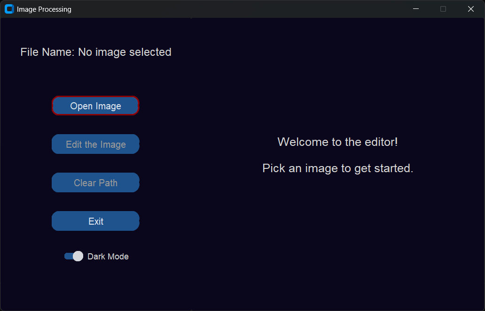
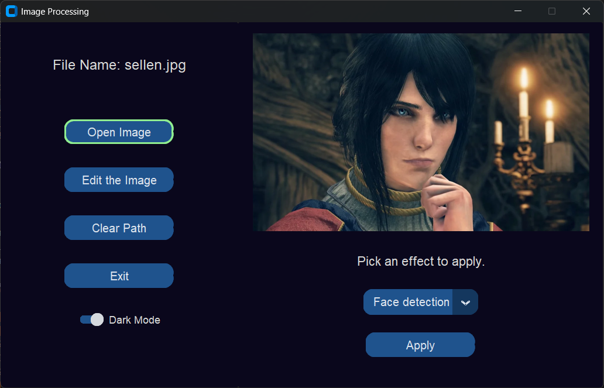

# 🖼️ Simple Image Editor

A lightweight image editor built with Python using `customtkinter` for the UI. It allows users to open images, apply visual effects, enhance images, and save the results. Built as part of a college project.

---

## ✨ Features

- Open and display images in a custom-themed window
- Apply filters (blur, contour, edge enhancement, etc.)
- Adjust brightness and contrast
- Applies computer vision for advanced features such as face recognition etc.
- User-friendly GUI using `customtkinter`

---

## 📦 Requirements

Make sure Python 3.8+ is installed, then install the required libraries:

```bash
pip install -r requirements.txt
```

## 🚀 How to Run

Clone the repository and run the Python script:

```bash
git clone https://github.com/mightbejazz/simple-image-editor.git
cd simple-image-editor
python main.py
```

## 🧠 Tech Stack

- **Language:** Python 3
- **GUI Framework:** [`customtkinter`](https://github.com/TomSchimansky/CustomTkinter)
- **Image Processing:**
  - [`Pillow`](https://python-pillow.org/) – for image manipulation
  - [`OpenCV`](https://pypi.org/project/opencv-python/) – for advanced processing
  - [`numpy`](https://numpy.org/) – for numerical operations
  - [`matplotlib`](https://matplotlib.org/) – for plotting (optional preview/debugging)
- **User Interaction:**
  - [`pyautogui`](https://pyautogui.readthedocs.io/) – for screen-based actions
  - Built-in `tkinter` – for basic dialogs (file open/save, alerts)

## 📸 Screenshots
 
Example:

```markdown


```

## 🛠️ To-Do

- [ ] Dynamically scale the image container to match the editor frame size
- [ ] Add more image effects:
  - Sharpen
  - Invert colors
  - Sepia or color filters
- [ ] Add an undo/redo feature
- [ ] Add zoom and pan functionality
- [ ] Improve UI responsiveness and layout scaling

## 📄 License

This project is licensed under the [MIT License](https://opensource.org/licenses/MIT).  
You are free to use, modify, and distribute this software with proper attribution.

## 🙏 Acknowledgements

This project was made possible thanks to the following libraries and tools:

- [`customtkinter`](https://github.com/TomSchimansky/CustomTkinter) – Modern UI framework built on top of `tkinter`
- [`opencv-python`](https://pypi.org/project/opencv-python/) – Powerful computer vision library
- [`Pillow`](https://python-pillow.org/) – Python Imaging Library for image creation and editing
- [`numpy`](https://numpy.org/) – For efficient array and matrix operations
- [`matplotlib`](https://matplotlib.org/) – For visualizing and plotting image data (optional)
- [`pyautogui`](https://pyautogui.readthedocs.io/) – For screen capture and interaction
- The Python open-source community ✨